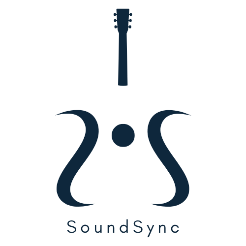

<!-- Improved compatibility of back to top link: See: https://github.com/othneildrew/Best-README-Template/pull/73 -->
<a name="readme-top"></a>
<!--
*** Thanks for checking out the Best-README-Template. If you have a suggestion
*** that would make this better, please fork the repo and create a pull request
*** or simply open an issue with the tag "enhancement".
*** Don't forget to give the project a star!
*** Thanks again! Now go create something AMAZING! :D
-->


<!-- PROJECT LOGO -->
<br />
<div align="center">
  <a href="https://github.com/othneildrew/Best-README-Template">
    
  </a>

  <h3 align="center">SoundSync</h3>

  <p align="center">
    A real-time, audio-responsive digital sheet music platform for seamless musician synchronization.
    <br />
    <br />
    <a href="https://youtu.be/EhhmW8895KI">View Demo</a>
    ·
    <a href="https://github.com/aiRamo/SoundSync/issues">Report Bug</a>
    ·
    <a href="https://github.com/aiRamo/SoundSync/issues">Request Feature</a>
  </p>
</div>


<!-- TABLE OF CONTENTS -->
<details>
  <summary>Table of Contents</summary>
  <ol>
    <li>
      <a href="#about-the-project">About The Project</a>
      <ul>
        <li><a href="#built-with">Built With</a></li>
      </ul>
    </li>
    <li>
      <a href="#getting-started">Getting Started</a>
      <ul>
        <li><a href="#prerequisites">Prerequisites</a></li>
        <li><a href="#installation">Installation</a></li>
      </ul>
    </li>
    <li><a href="#usage">Usage</a></li>
    <li><a href="#acknowledgments">Acknowledgments</a></li>
  </ol>
</details>


<!-- ABOUT THE PROJECT -->
## About The Project

[![Product Name Screen Shot][product-screenshot]]

SoundSync is a web application with the main goal of eliminating the need to manually turn a sheet
music page when playing an instrument. 

SoundSync is capable of:
* Scanning a physical piece of sheet music and creating a digital copy
* Utilizing an audio recording to detect which notes are being played in real-time
* Tracking and displaying where the user is playing on the sheet music

<p align="right">(<a href="#readme-top">back to top</a>)</p>


### Built With

* [![React_Native][React_Native]][React_Native-url]
* [![Expo][Expo]][Expo-url]
* [![Firebase][Firebase]][Firebase-url]
* [![Node][Node.js]][Node.js-url]
* [![Lilypond][Lilypond]][Lilypond-url]
* [![Audiveris][Audiveris]][Audiveris-url]


<p align="right">(<a href="#readme-top">back to top</a>)</p>


<!-- GETTING STARTED -->
## Getting Started

This is an example of how you may give instructions on setting up your project locally.
To get a local copy up and running follow these simple example steps.

### Prerequisites

This is an example of how to list things you need to use the software and how to install them.
* npm
  ```sh
  npm install npm@latest -g
  ```

### Installation

_Below is an example of how you can instruct your audience on installing and setting up your app. This template doesn't rely on any external dependencies or services._

1. Get a free API Key at [https://example.com](https://example.com)
2. Clone the repo
   ```sh
   git clone https://github.com/your_username_/Project-Name.git
   ```
3. Install NPM packages
   ```sh
   npm install
   ```
4. Enter your API in `config.js`
   ```js
   const API_KEY = 'ENTER YOUR API';
   ```

<p align="right">(<a href="#readme-top">back to top</a>)</p>


<!-- USAGE EXAMPLES -->
## Usage

Use this space to show useful examples of how a project can be used. Additional screenshots, code examples and demos work well in this space. You may also link to more resources.

* Sheet Music Digital Recreation and Note Recognition


![Recognition Screen Shot][recognition-screenshot]
  
* Real-time Audio Note Tracking


<p align="right">(<a href="#readme-top">back to top</a>)</p>

<!-- ACKNOWLEDGMENTS -->
## Acknowledgments

Use this space to list resources you find helpful and would like to give credit to. I've included a few of my favorites to kick things off!

* [Choose an Open Source License](https://choosealicense.com)
* [GitHub Emoji Cheat Sheet](https://www.webpagefx.com/tools/emoji-cheat-sheet)
* [Malven's Flexbox Cheatsheet](https://flexbox.malven.co/)
* [Malven's Grid Cheatsheet](https://grid.malven.co/)
* [Img Shields](https://shields.io)
* [GitHub Pages](https://pages.github.com)
* [Font Awesome](https://fontawesome.com)
* [React Icons](https://react-icons.github.io/react-icons/search)

<p align="right">(<a href="#readme-top">back to top</a>)</p>


<!-- MARKDOWN LINKS & IMAGES -->
<!-- https://www.markdownguide.org/basic-syntax/#reference-style-links -->
[contributors-shield]: https://img.shields.io/github/contributors/othneildrew/Best-README-Template.svg?style=for-the-badge
[contributors-url]: https://github.com/othneildrew/Best-README-Template/graphs/contributors
[forks-shield]: https://img.shields.io/github/forks/othneildrew/Best-README-Template.svg?style=for-the-badge
[forks-url]: https://github.com/othneildrew/Best-README-Template/network/members
[stars-shield]: https://img.shields.io/github/stars/othneildrew/Best-README-Template.svg?style=for-the-badge
[stars-url]: https://github.com/othneildrew/Best-README-Template/stargazers
[issues-shield]: https://img.shields.io/github/issues/othneildrew/Best-README-Template.svg?style=for-the-badge
[issues-url]: https://github.com/othneildrew/Best-README-Template/issues
[license-shield]: https://img.shields.io/github/license/othneildrew/Best-README-Template.svg?style=for-the-badge
[license-url]: https://github.com/othneildrew/Best-README-Template/blob/master/LICENSE.txt
[linkedin-shield]: https://img.shields.io/badge/-LinkedIn-black.svg?style=for-the-badge&logo=linkedin&colorB=555
[linkedin-url]: https://linkedin.com/in/othneildrew
[product-screenshot]: assets/SS_Screenshot.png
[recognition-screenshot]: assets/Recognition_Screenshot.png
[React_Native]: https://img.shields.io/badge/React%20Native%20-badge?style=for-the-badge&logo=React&color=%23050e30
[React_Native-url]: https://reactnative.dev/
[Expo]: https://img.shields.io/badge/Expo-badge?style=for-the-badge&logo=Expo&color=black
[Expo-url]: https://expo.dev/
[Firebase]: https://img.shields.io/badge/Firebase-badge?style=for-the-badge&logo=firebase&color=grey
[Firebase-url]: https://firebase.google.com/
[Node.js]: https://img.shields.io/badge/node.js-badge?style=for-the-badge&logo=Node.JS&color=black
[Node.js-url]: https://nodejs.org/en/about
[Lilypond]: https://img.shields.io/badge/Lilypond%20-badge?style=for-the-badge&logo=Lilypond&color=%23075e12
[Lilypond-url]: https://lilypond.org/
[Audiveris]: https://img.shields.io/badge/Audiveris-badge?style=for-the-badge&logo=Audiveris&color=orange
[Audiveris-url]: https://github.com/audiveris

